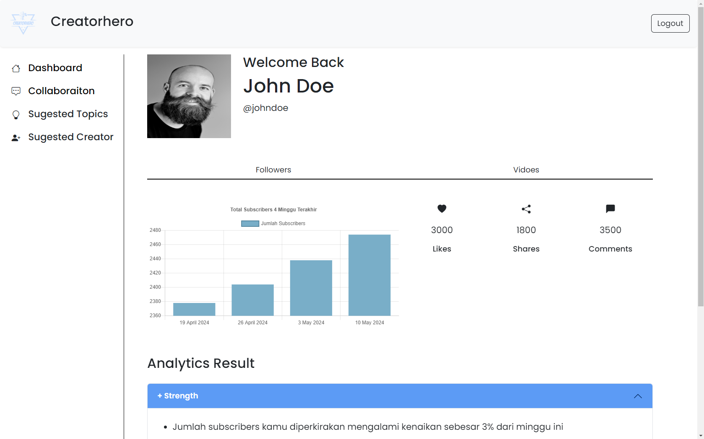
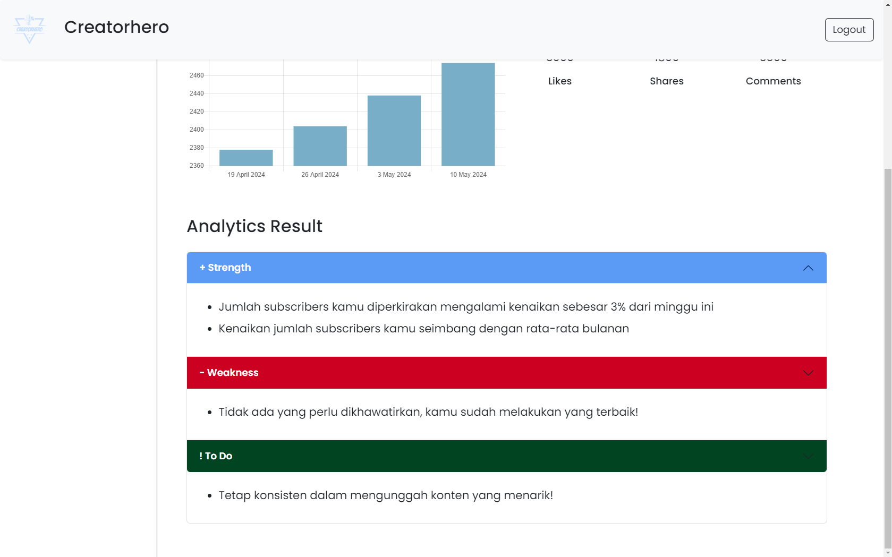
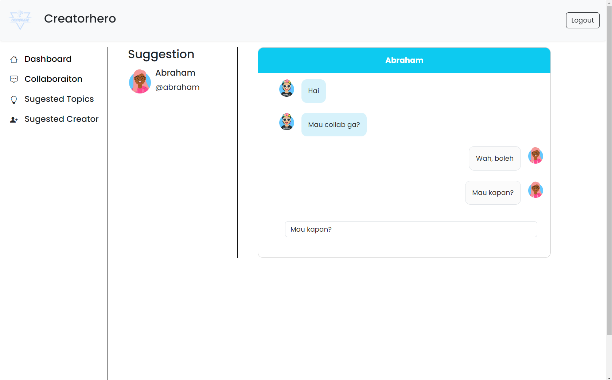

# CreatorHero
CreatorHero merupakan sebuah apliaksi website untuk membantu creator dalam melakukan analisa, optimasi, membangun, dan mengembangkan content mereka.

Dalam aplikasi ini, creator bisa melihat data profile secara ringkas. Dalam kasus ini, profil social media berbentuk **dummy** dan fokus dalam platform **youtube**.

## Screenshots
Berikut adalah beberapa screenshot dari hasil website yang telah dibuat:

### Dashboard Analytics
Pada halaman ini, creator bisa melihat jumlah subscribers dari 1 bulan belakang dalam bentuk grafik

Creator juga bisa melihat total likes, shares, dan comments dari video yang sudah pernah diupload (**dummy**).

### Dasgviard Suggestion
Pada bagian ini, creator bisa menemukan **strength**, **weakness**, dan to **do do** dari hasil analisis yang dilakukan oleh AI.

Algoritma yang digunakan dalam AI ini adalah **linear regression dan k means clustering**.

#### Linear Regression
Linear regression adalah algortima supervised learning yang digunakan untuk memprediksi nilai prediksi berdasarkan satu atau lebih variabel. Algoritma ini dugnakna untuk memprediksi jumlah subscribers untuk 1 bulan berikutnya.

#### K Means clustering
K-means clustering adalah algoritma unsupervised learning yang digunakan untuk mengelompokkan data menjadi sejumlah cluster (kelompok) yang berbeda. Algoritma ini dugnakan untuk menentukan pada bulan apa saja jumlah subscribers seseorang mengalami kenaikan dan penurunan pada bulan - bulan tertentu.

### Collaboration Chat
Creator bisa berkomunikasi dengan creator lain via chat berdasarkan kategori video yang sering diupload.

## Video Link
Video link dapat dilihat [di sini](https://www.youtube.com/)

## Bottom Line
Terima kasih untuk kontribusi tim:
* Teresa Tania Tamsil (hustler)
* Dimas Dani Zaini (Hacker)
* Valeriene Anjanette (Hipster)
